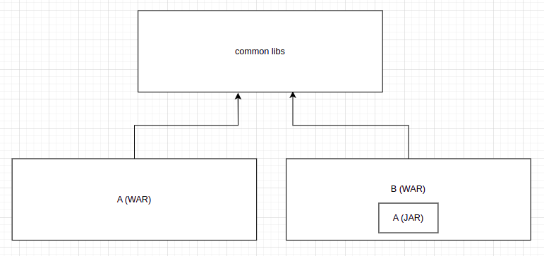

# Add a war as a dependency to another

There are several ways to add dependencies in Java Enterprise applications. If we think from maven perspective, there are "compile" scoped dependencies and "provided" scoped dependencies. 

I'm more focused about creating a web service(as a WAR) here. If we set the scope as "compile", You'll be abe to see the dependencies in the WAR file. Which means "compile" scope dependencies will be bundled with the WAR. In other hand, The dependencies with "provided" scope, will not be bundled with the WAR, and we'll have to provide those dependencies separately. 

Also, this is how class loaders working in the tomcat.

So any given class will first check in the WebApp ClassLoader, That class loader contains the class files of the code and the "compile" scope dependencies. If the given class not available in that ClassLoader, It'll be looked in the Common Class Loader, We have to put any "provided" scope dependency jars there.

If we put the same dependency with scope "compile" to two WARs, The same class will be defined twice for both the contexts, and we won't be able to even cast them. But if we put the dependency scope as "provided" and put the relevant jar in lib folder. The class will be shared between both the contexts. 

So if we're sharing the same dependency between multiple contexts(WAR files), most of the time it's better to put as "provided". If we put a dependency as "compile", even singleton classes may have different instance per each context in the same JVM.

So above is just an intro, Let's say we have a scenario like this. I have two projects A and B. Both A and B packaged as WAR files and will be run in the tomcat. But I need to access classes in A from the B. 

### Approach 1
We can create a jar from the A and add that as a "compile" scope dependency to the B. This way B can access any class in A. But all the classes in project A, will be defined twise in the runtime. Because now classes required for A loaded from A WebApp class loader and classes required for B loaded from B WebApp. Since A contains as a jar in the B, that won't be a problem. 

But what if we need to access the same class, we need to access the same static variables, same singleton instances in A, for the B as well. Then this won't work. Because even fully qualified names of the classes are equal, classes are different. Because they are loaded from different loaders.

### Approach 2
So Approach 1 won't work if we need to share the exact class at runtime, so if we need to share even static variables, singleton instances between two contexts, we can use this approach.

We'll have to create a new project C and need to move all the classes which we will need to be shared between two contexts from the project A. This project will be packaged as JAR. And we'll have to add this C as a provided dependency to both A and B. This C jar need to be put in the lib folder to provide it when the tomcat is started.

Now the classes in C will be same for both A and B, because those are loaded from the shared class loader. So any static variables, singleton instances will be common for both as long as classes in the common class loader.

But here, we'll have to move any class in A which we need to be accessed in B to the C jar. Sometimes that could be difficult in a legacy code. 

### Approach 3
Tomcat provides a way to set a custom class loader for a web app. That can be done via the context.xml. 

