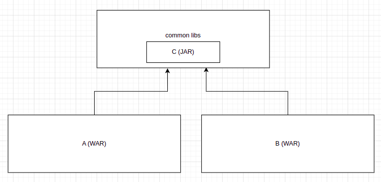

# Add a running WAR as a runtime dependency to another WAR

There are several ways to add dependencies in Java Enterprise applications. If we think from a maven perspective, there are "compile" scoped dependencies and "provided" scoped dependencies.

I'm more focused on creating a web service(as a WAR) here. If we set the scope as "compile", You'll be able to see the dependencies in the WAR file. This means "compile" scope dependencies will be bundled with the WAR. On other hand, The dependencies with "provided" scope, will not be bundled with the WAR, and we'll have to provide those dependencies separately.

Also, this is how class loaders work in the tomcat.


So any given class will first check in the WebApp ClassLoader, That class loader contains the class files of the code and the "compile" scope dependencies. If the given class is not available in that ClassLoader, It'll be looked in the Common Class Loader, We have to put any "provided" scope dependency jars there.

If we put the same dependency with scope "compile" to two WARs, The same class will be defined twice for both contexts, and we won't be able to even cast them. But if we put the dependency scope as "provided" and put the relevant jar in lib folder. The class will be shared between both contexts.


So if we're sharing the same dependency between multiple contexts(WAR files), most of the time it's better to put as "provided". If we put a dependency as "compile", even singleton classes may have different instances per each context in the same JVM.


So above is just an intro, Let's say we have a scenario like this. I have two projects A and B. Both A and B are packaged as WAR files and will be run in the tomcat. But I need to access classes in A from B.

### Approach 1
We can create a jar from the A and add that as a "compile" scope dependency to the B. This way B can access any class in A. But all the classes in project A will be defined twice in the runtime. Because now classes required for A loaded from A WebApp class loader and classes required for B loaded from B WebApp. Since A contains as a jar in B, that won't be a problem.

But what if we need to access the same class, we need to access the same static variables, same singleton instances in A, for the B as well. Then this won't work. Because even fully qualified names of the classes are equal, classes are different. Because they are loaded from different loaders.


### Approach 2
So Approach 1 won't work if we need to share the exact class at runtime, so if we need to share even static variables or singleton instances between two contexts, we can use this approach.

We'll have to create a new project C and need to move all the classes which we will need to be shared between two contexts from project A. This project will be packaged as a JAR. And we'll have to add this C as a provided dependency to both A and B. This C jar needs to be put in the lib folder to provide it when the tomcat is started.

Now the classes in C will be the same for both A and B, because those are loaded from the shared class loader. So any static variables or singleton instances will be common for both as long as classes are in the common class loader.

But here, we'll have to move any class in A that we need to be accessed in B to the C jar. Sometimes that could be difficult in a legacy code.



### Approach 3
Tomcat provides a way to set a custom class loader for a web app. That can be done via the context.xml. We can create our own class loader and from it, we can redirect any request from B to the class loader A.

This way A can run independently and B can have A as a dependency as well.


## Approach 3 Implementation - Add A WAR as a dependency while running independently

I have a project called "parent-war", a Simple POST request implemented here. For any POST request invocation, this will add a key-value pair to a Map that is static. and located in a class called "ParentTestClass". This class needs to be accessed from another web application called "child-war". We'll have to set a custom class loader to the child-war, That custom class loader is located in a separate project called "custom-classloader".

### Implement custom class loader

Tomcat allows us to set a ClassLoader which extends WebappClassLoaderBase as the context class loader. Which means class loader of the web application.

```java
public class ContextClassLoader extends WebappClassLoaderBase {

    public ContextClassLoader(ClassLoader parent) {
        super(new ProxyClassLoader(parent));
    }

    @Override
    public ClassLoader copyWithoutTransformers() {
        ContextClassLoader result = new ContextClassLoader(getParent());

        super.copyStateWithoutTransformers(result);

        try {
            result.start();
        } catch (LifecycleException e) {
            throw new IllegalStateException(e);
        }

        return result;
    }
}
```

In the constructor we have to set the parent ClassLoader, It's received by us in the parameter parent. This parent will be the Common ClassLoader. Instead of setting that, we are setting ProxyClassLoader as the parent. Which is our custom-implemented ClassLoader with a proxy design pattern. This contains two variables, actualClassLoader is the true parent which is Common ClassLoader, another one is foreignClassLoader, It should be the parent class loader, later we'll have to register the foreignClassLoader once Parent-WAR is initialized.

So in the loadClass method any class load request received, will be sent to the foreignClassLoader(Parent-WAR) if it available.

We have to package this project as jar and put it as a provided dependency in tomcat. Because this should be common for both WARs.

```java
public class ProxyClassLoader extends ClassLoader{
    private ClassLoader actualClassLoader;
    private static ClassLoader foreignClassLoader;

    public ProxyClassLoader(ClassLoader actualClassLoader) {
        this.actualClassLoader = actualClassLoader;
    }

    @Override
    public String getName() {
        return actualClassLoader == null ? null : actualClassLoader.getName();
    }

    @Override
    public Class<?> loadClass(String name) throws ClassNotFoundException {
        return (foreignClassLoader == null ? actualClassLoader : foreignClassLoader).loadClass(name);
    }

    @Override
    public URL getResource(String name) {
        return actualClassLoader.getResource(name);
    }

    @Override
    public Enumeration<URL> getResources(String name) throws IOException {
        return actualClassLoader.getResources(name);
    }

    @Override
    public Stream<URL> resources(String name) {
        return actualClassLoader.resources(name);
    }

    public static URL getSystemResource(String name) {
        return ClassLoader.getSystemResource(name);
    }

    public static Enumeration<URL> getSystemResources(String name) throws IOException {
        return ClassLoader.getSystemResources(name);
    }

    @Override
    public InputStream getResourceAsStream(String name) {
        return actualClassLoader.getResourceAsStream(name);
    }

    public static InputStream getSystemResourceAsStream(String name) {
        return ClassLoader.getSystemResourceAsStream(name);
    }

    public static ClassLoader getPlatformClassLoader() {
        return ClassLoader.getPlatformClassLoader();
    }

    public static ClassLoader getSystemClassLoader() {
        return ClassLoader.getSystemClassLoader();
    }

    @Override
    public void setDefaultAssertionStatus(boolean enabled) {
        actualClassLoader.setDefaultAssertionStatus(enabled);
    }

    @Override
    public void setPackageAssertionStatus(String packageName, boolean enabled) {
        actualClassLoader.setPackageAssertionStatus(packageName, enabled);
    }

    @Override
    public void setClassAssertionStatus(String className, boolean enabled) {
        actualClassLoader.setClassAssertionStatus(className, enabled);
    }

    @Override
    public void clearAssertionStatus() {
        actualClassLoader.clearAssertionStatus();
    }

    public ClassLoader getActualClassLoader() {
        return actualClassLoader;
    }

    public void setActualClassLoader(ClassLoader actualClassLoader) {
        this.actualClassLoader = actualClassLoader;
    }

    public static ClassLoader getForeignClassLoader() {
        return foreignClassLoader;
    }

    public static void setForeignClassLoader(ClassLoader foreignClassLoader) {
        ProxyClassLoader.foreignClassLoader = foreignClassLoader;
    }

    public static boolean isReady(){
        return foreignClassLoader!=null;
    }
}
```


### Parent WAR

Parent WAR needs to be registered as the foreignClassLoader. So we've added a ServletContextListener like the below to make sure WAR is initialized. This file is webapps/WEB-INF/web.xml.

```xml
<?xml version="1.0" encoding="UTF-8"?>
<web-app xmlns="http://java.sun.com/xml/ns/javaee"
         xmlns:xsi="http://www.w3.org/2001/XMLSchema-instance"
         xsi:schemaLocation="http://java.sun.com/xml/ns/javaee
		  http://java.sun.com/xml/ns/javaee/web-app_2_5.xsd"
         version="2.5" metadata-complete="true">

    <servlet>
        <servlet-name>test-service</servlet-name>
        <servlet-class>org.example.parent.servlet.ServiceServlet</servlet-class>
    </servlet>
    <servlet-mapping>
        <servlet-name>test-service</servlet-name>
        <url-pattern>/</url-pattern>
    </servlet-mapping>

    <listener>
        <listener-class>org.example.parent.servlet.CustomServletContextListener</listener-class>
    </listener>
</web-app>

```

ClassLoader registered here.
```java
public class CustomServletContextListener implements ServletContextListener {
    private static final Logger LOGGER = Logger.getLogger(CustomServletContextListener.class.getName());

    @Override
    public void contextInitialized(ServletContextEvent sce) {
        LOGGER.info("Parent-War Initialized !");
        try {
            ProxyClassLoader.setForeignClassLoader(this.getClass().getClassLoader());
            LOGGER.log(Level.INFO, "Classloader registration success!", new Object[]{  });
        } catch (Exception e) {
            LOGGER.log(Level.WARNING, "ClassLoader registration failed!");
        }
    }

    @Override
    public void contextDestroyed(ServletContextEvent sce) {

    }
}
```

So this is the class that need to be accessed from another WAR
```java
public class ParentTestClass {
    public static Map<String,String> data = new HashMap<>();
}
```


POST request implementation, this will put a key-value pair to the above map, Key value pair contains UUID as the key and string "parent" as the value.
```java
public class ServiceServlet extends HttpServlet {
	@Override
	protected void doPost(HttpServletRequest req, HttpServletResponse resp) throws IOException {
		try {
			ParentTestClass.data.put(UUID.randomUUID().toString(), "parent");
			resp.getWriter().write(ParentTestClass.data.toString());
		} catch (Throwable e) {
			e.printStackTrace();
		}
	}

	@Override
	protected void doGet(HttpServletRequest req, HttpServletResponse resp) throws ServletException, IOException {
		resp.getWriter().write("parent ok");
	}
}
```

Also, parent-war needs to be added as a provided dependency to the child-war. To do so, need to create a jar from the parent-war. So we need to create both war and jar for parent-war. That can be done via maven profiles.

```xml
<?xml version="1.0" encoding="UTF-8"?>
<project xmlns="http://maven.apache.org/POM/4.0.0"
         xmlns:xsi="http://www.w3.org/2001/XMLSchema-instance"
         xsi:schemaLocation="http://maven.apache.org/POM/4.0.0 http://maven.apache.org/xsd/maven-4.0.0.xsd">
    <parent>
        <artifactId>war-dependency-example</artifactId>
        <groupId>org.example</groupId>
        <version>1.0-SNAPSHOT</version>
    </parent>
    <modelVersion>4.0.0</modelVersion>

    <artifactId>parent-war</artifactId>
    <packaging>${packaging.type}</packaging>

    <properties>
        <maven.compiler.source>11</maven.compiler.source>
        <maven.compiler.target>11</maven.compiler.target>
        <project.build.sourceEncoding>UTF-8</project.build.sourceEncoding>
    </properties>

    <profiles>
        <profile>
            <id>parent-war</id>
            <properties>
                <packaging.type>war</packaging.type>
            </properties>
        </profile>
        <profile>
            <id>parent-jar</id>
            <properties>
                <packaging.type>jar</packaging.type>
            </properties>
        </profile>
    </profiles>

    <dependencies>
        <dependency>
            <groupId>org.example</groupId>
            <artifactId>custom-classloader</artifactId>
            <version>1.0-SNAPSHOT</version>
            <scope>provided</scope>
        </dependency>
    </dependencies>

    <build>
        <finalName>${artifactId}</finalName>
        <plugins>
            <plugin>
                <groupId>org.apache.maven.plugins</groupId>
                <artifactId>maven-war-plugin</artifactId>
                <configuration>
                    <webXml>src\main\webapp\WEB-INF\web.xml</webXml>
                </configuration>
            </plugin>
        </plugins>
    </build>
</project>
```

### Child WAR

Now we can implement the child-war. We need to set our custom context class loader here. That can be done from context.xml which located in webapp/META-INF/context.xml .

```xml
<Context>
    <Loader loaderClass="org.example.ContextClassLoader" />
</Context>
```

This WAR will not allow any traffic unless the parent-war class loader is registered. That is done by adding a filter from the web.xml.

```xml
<?xml version="1.0" encoding="UTF-8"?>
<web-app xmlns="http://java.sun.com/xml/ns/javaee"
         xmlns:xsi="http://www.w3.org/2001/XMLSchema-instance"
         xsi:schemaLocation="http://java.sun.com/xml/ns/javaee
		  http://java.sun.com/xml/ns/javaee/web-app_2_5.xsd"
         version="2.5" metadata-complete="true">

    <servlet>
        <servlet-name>test-service</servlet-name>
        <servlet-class>org.example.child.servlet.ServiceServlet</servlet-class>
    </servlet>
    <servlet-mapping>
        <servlet-name>test-service</servlet-name>
        <url-pattern>/</url-pattern>
    </servlet-mapping>

    <filter>
        <filter-name>readiness-check-filter</filter-name>
        <filter-class>org.example.child.servlet.ReadinessCheckFilter</filter-class>
    </filter>
    <filter-mapping>
        <filter-name>readiness-check-filter</filter-name>
        <url-pattern>/</url-pattern>
    </filter-mapping>

    <listener>
        <listener-class>org.example.child.servlet.CustomServletContextListener</listener-class>
    </listener>
</web-app>
```

Need to add parent-war as a dependency here in POM.
```xml
<?xml version="1.0" encoding="UTF-8"?>
<project xmlns="http://maven.apache.org/POM/4.0.0"
         xmlns:xsi="http://www.w3.org/2001/XMLSchema-instance"
         xsi:schemaLocation="http://maven.apache.org/POM/4.0.0 http://maven.apache.org/xsd/maven-4.0.0.xsd">
    <parent>
        <artifactId>war-dependency-example</artifactId>
        <groupId>org.example</groupId>
        <version>1.0-SNAPSHOT</version>
    </parent>
    <modelVersion>4.0.0</modelVersion>

    <artifactId>custom-classloader</artifactId>

    <properties>
        <maven.compiler.source>11</maven.compiler.source>
        <maven.compiler.target>11</maven.compiler.target>
        <project.build.sourceEncoding>UTF-8</project.build.sourceEncoding>
    </properties>

    <dependencies>
        <dependency>
            <groupId>org.apache.tomcat</groupId>
            <artifactId>tomcat-catalina</artifactId>
            <version>8.5.24</version>
        </dependency>
    </dependencies>
</project>
```

This web app also has a similar POST request, Which will put the key-value pair to the ParentTestClass which is located in parent-war. The key value pair contains UUID as the key and the string "child" as the value.

```java
public class ServiceServlet extends HttpServlet {
	@Override
	protected void doPost(HttpServletRequest req, HttpServletResponse resp) throws IOException {
		try {
			ParentTestClass.data.put(UUID.randomUUID().toString(), "child");
			resp.getWriter().write(ParentTestClass.data.toString());
		} catch (Throwable e) {
			e.printStackTrace();
		}
	}

	@Override
	protected void doGet(HttpServletRequest req, HttpServletResponse resp) throws ServletException, IOException {
		resp.getWriter().write("child ok");
	}
}
```

So if this worked successfully, we should be able to access ParentTestClass from the child-war and the map should be the same for both WARs. We can test this out by sending a request to each servlet. Both will print the entire map after the key value is inserted. 

Finally, to run this, you'll need to add both war files into the tomcat webapps folder and need to add custom-classloader as a provided dependency. If we take a new tomcat, that would not take any jar in tomcat/lib folder as provided dependency. So to make it happen, you'll need to create a setenv.sh in bin folder if not exists and add the below the line there.


```shell
CLASSPATH="$CLASSPATH:$CATALINA_HOME/lib/*"
```

So now you can run the tomcat and send requests to both child-war and parent-war. You'll see both sharing the same map.


## Build / Run / Test

You can build/run/test easily using the given run.sh shell file. The prerequisites you need are java 11, maven 3, and docker in your machine. (If your machine is windows, you may run the steps, manually. or can create a batch file or the easiest way is to run the shell file in Cygwin terminal like mobaxterm.)

### That's all :)

#### Finally
If anything is not clear or needs to explain further please let me know. If this article contains any detail that needs to be corrected please let me know as well. This is written based on my work experience. My email is [zchandikaz@gmail.com](mailto:zchandikaz@gmail.com).

Cheers!